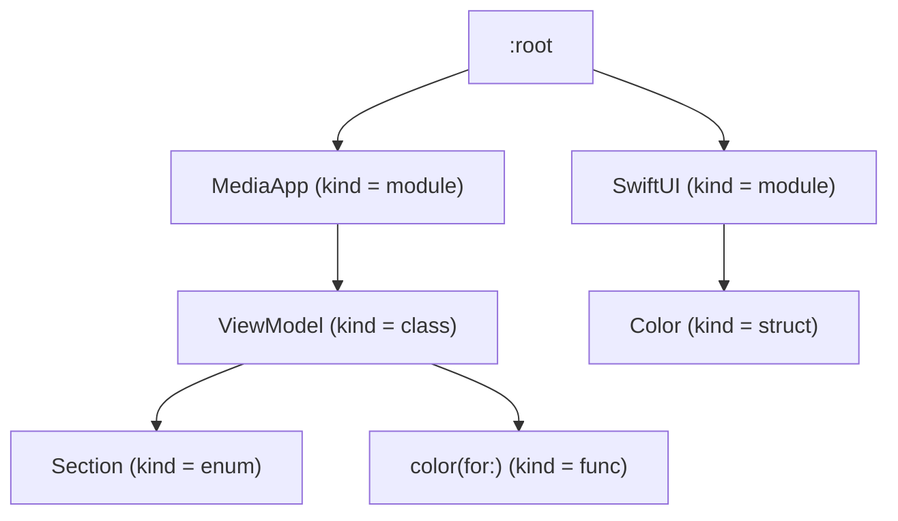

## swiftype-dump

This is a work-in-progress project.

The goal of `swiftype-dump` is to produce a `.swiftinterface` file given a Mach-O as input.

Thanks to help from https://derekselander.github.io/dsdump/#swift
and https://github.com/blacktop/ipsw/blob/adf12a3/cmd/ipsw/cmd/swift_dump.go

### Design

My current idea for the architecture is to gather all the metadata we have access to,
represent that metadata in a tree, then produce an interface using the tree.

#### Data sources

The sources are:

- Information from `__TEXT,__swift5_types` section
- All the names for symbols defined in the binary which appear to be Swift functions

Each of these sources will provide a full "path" to the type information.

For example,
[`CanonicalCombiningClass`](https://developer.apple.com/documentation/swift/unicode/canonicalcombiningclass)
is a `struct` in the `enum` named `Unicode` which is in the module named `Swift`.
The mangled name for this type is `s7UnicodeO23CanonicalCombiningClassV`.
This encodes the full type information:

```
s // special case for Swift module
7UnicodeO
    7 // length
    Unicode // name
    O // kind = enum
23CanonicalCombiningClassV
    23 // length
    CanonicalCombiningClass // name
    V // kind = struct
```

See https://github.com/swiftlang/swift/blob/swift-6.0-RELEASE/docs/ABI/Mangling.rst
for more information on decoding these mangled names.

The data in `__TEXT,__swift5_types` has even more information and parsing the data
is currently implemented in this repo.

#### Consuming the data

As we gather this information, we can place the type information in a tree.
Swift calls each piece of "type information" a `Demangle::Node`.
I'll use this name for clarity in this section.
The name "node" also makes sense as we place these in a tree.

We'll start with a root node and add objects using their full paths
into the tree. Since each node in a path has a "kind" (`struct`, `enum`, etc.)
we should check and `assert` that the kinds match between what we're inserting
and what's currently in the tree.

Let's look at an example:

```swift
import SwiftUI

public class ViewModel {
    public enum Section {
        case books
        case movies
    }
    
    public func color(for section: Section) -> Color {
        // ...
    }
}
```

Let's say this code is in a module called `MediaApp`.

The graph should look approximately like this:



When we parse the `color(for:)` function, we also add the return type and all the parameter types to the tree.

#### Generation

We can take our tree and the name of a module to produce a Swift interface.

We start by looking at our tree and finding every module that is not the input module.
Add `import` statements for each of these modules.

Next we go through the input module and produce definitions for each entry
(this is not trivial, however it's been mostly implemented in this repo and other projects have implemented it).
